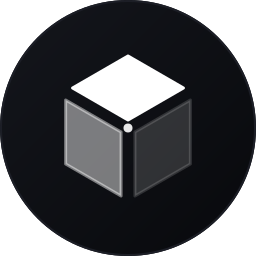

<div align="center">
  
  <h1>EasyAssemblies</h1>
  <p><strong>EVE Frontier Smart Assemblies Low-Code Platform</strong></p>
  <p><em>Build powerful Smart Assemblies like building blocks — no Move experience required.</em></p>
  <br/>
  <p><sub>A tribute to EVE Online — inspired by the frontier spirit that drives civilization forward.</sub></p>
</div>

---

## Inspiration: A Toolkit for Civilization

> *"In the early days of human civilization, the invention of the printing press did not change the world because one person could print a book. It changed the world because everyone could."*

The EVE Frontier hackathon theme is **"A Toolkit for Civilization."** When we first encountered this prompt, our instinct was to build a single impressive machine — a trading hub, a bounty hunter system, a logistics pipeline. But as we explored EVE Frontier's vast universe, we realized something fundamental: the distances between players and tribes span astronomical scales. A single machine, no matter how powerful, cannot knit a civilization together across such vastness.

What truly accelerates the growth of civilization is not one extraordinary tool, but a technology that empowers *everyone* to build. The printing press didn't matter because of the first book it printed — it mattered because it gave every village, every scholar, every rebel the power to share knowledge and forge connections.

**EasyAssemblies is our printing press for EVE Frontier.**

Instead of crafting one Smart Assembly, we built a platform that lets *every* player — regardless of technical skill — deploy their own Smart Gates, Storage Units, and Defense Turrets. When one tribe builds a toll gate, it's a checkpoint. When every tribe builds toll gates, trade routes emerge. When trade routes emerge, alliances form. When alliances form, civilization grows.

Our bet is simple: lower the barrier to zero, and the players will build the civilization themselves.

---

## Introduction

**EasyAssemblies** is a zero-barrier, low-code deployment platform for [EVE Frontier](https://evefrontier.space/) players, alliance operators, and infrastructure builders.

In EVE Frontier, constructing Smart Assemblies (Smart Gates, Storage Units, and Defense Turrets) requires writing and deploying Move smart contracts on the Sui blockchain. For most players, this is a steep barrier that takes time away from strategy and community building.

EasyAssemblies removes that barrier entirely. Choose a hardware template, visually plug in pre-audited **Protocol Chips**, and the platform compiles and deploys Move bytecode directly in your browser. No backend servers. No development environment. Just clicks.

---

[Try it out here：https://superchainstage.github.io/EasyAssemblies/](https://superchainstage.github.io/EasyAssemblies/)


## Key Features

**Visual Chip Assembly** — Select a component type, pick a template, and configure Protocol Chips through an intuitive UI. The platform generates production-ready Move source code from your selections automatically.

**In-Browser WASM Compilation** — Powered by `@zktx.io/sui-move-builder`. All code generation, dependency resolution, and WASM compilation happens entirely in the browser. No centralized build server required.

**One-Click Blockchain Deployment** — Integrated with `@mysten/dapp-kit`. Connect your Sui wallet, publish the compiled package, and run post-deploy configuration transactions in a single guided flow.

**Expert Mode** — Power users can open the built-in code editor (macOS-style window with FileTree, CodeMirror editor, and ANSI console) to inspect or modify the generated Move code before compilation.

**Dual Network Support** — Switch between EVE Frontier Stillness (testnet) and Utopia (testnet) networks via the status bar.

---

## Assembly Components

EasyAssemblies supports three core Smart Assembly types, each with multiple templates and a configurable chip system.

### Smart Gate

Controls access to jump gates. 5 templates, 11 chips, 14 presets.

| Template | Description |
|----------|-------------|
| **Tribe Permit** | Tribe-based access control. Restrict passage to specific tribes via whitelist or blacklist. |
| **Toll Gate** | Charge SUI tokens for passage. Supports tribe discounts and free-for-ally rules. |
| **Bounty Gate** | Require item submission (bounties) for passage. Supports multi-item and minimum quantity checks. |
| **Open Permit** | No restrictions. Issues a time-limited permit to any character that requests one. |
| **Multi-Rule** | Combine access, payment, and revenue rules into a single gate with layered security. |

<details>
<summary><strong>Gate Chips (11)</strong></summary>

**Access**
| Chip | Label | Mode | Description |
|------|-------|------|-------------|
| A1 | Single Tribe | radio | Only characters from one configured tribe may pass |
| A2 | Multi-Tribe Whitelist | radio | Allow characters from multiple allied tribes |
| A3 | Tribe Blacklist | radio | Block specific tribes; everyone else passes |

**Payment**
| Chip | Label | Mode | Description |
|------|-------|------|-------------|
| P1 | Fixed Price | checkbox | Require a fixed SUI payment for passage |
| P2 | Tribe Discount | checkbox | Allied tribes pay a discounted fare |
| P3 | Free for Tribe | checkbox | Specified tribes pass free |

**Revenue**
| Chip | Label | Mode | Description |
|------|-------|------|-------------|
| R1 | Owner Collect | checkbox | Transfer payment to the gate owner |

**Item**
| Chip | Label | Mode | Description |
|------|-------|------|-------------|
| I1 | Single Item Type | radio | Accept one specific item type as bounty |
| I2 | Multi-Item Accept | radio | Accept any of several item types |
| I3 | Minimum Quantity | checkbox | Require a minimum number of items |

**Config**
| Chip | Label | Mode | Description |
|------|-------|------|-------------|
| C1 | Fixed Expiry | checkbox | Set permit expiry duration |

</details>

### Storage Unit (SSU)

Programmable storage for trading, swapping, airdropping, and access-controlled vaults. 5 templates, 18 chips, 12 presets.

| Template | Description |
|----------|-------------|
| **Vending Machine** | Automated unmanned shop. Set prices, manage stock, and collect revenue. |
| **Item Swap** | Exchange items at fixed ratios. Single-pair or multi-pair configurations. |
| **Gated Locker** | Shared storage restricted by tribe. Supports deposit-only and item whitelists. |
| **Airdrop Hub** | Distribute items to characters. One-time claims or unlimited supply. |
| **Open Storage** | Unrestricted storage container with no access rules. |

<details>
<summary><strong>SSU Chips (18)</strong></summary>

**Access**
| Chip | Label | Mode | Description |
|------|-------|------|-------------|
| A0 | Open Access | radio | No restrictions |
| A1 | Tribe Whitelist | radio | Only listed tribes may interact |
| A2 | Tribe Blacklist | radio | Block listed tribes; everyone else interacts |

**Pricing**
| Chip | Label | Mode | Description |
|------|-------|------|-------------|
| V1 | Fixed Price | checkbox | Fixed SUI price per unit |
| V2 | Tribe Discount | checkbox | Discounted price for allied tribes |
| V3 | Free for Tribe | checkbox | Free items for specified tribes |
| V4 | Bulk Discount | checkbox | Discount above a quantity threshold |

**Revenue**
| Chip | Label | Mode | Description |
|------|-------|------|-------------|
| R1 | Owner Collect | checkbox | Transfer payment to SSU owner |

**Stock**
| Chip | Label | Mode | Description |
|------|-------|------|-------------|
| S1 | Single Item Type | radio | Sell one item type |
| S2 | Multi-Item Catalog | radio | Sell multiple item types independently |

**Item**
| Chip | Label | Mode | Description |
|------|-------|------|-------------|
| I0 | Any Item | radio | No item type restrictions |
| I1 | Item Whitelist | radio | Only allow specific item types |
| I2 | Deposit Only | checkbox | Deposits only; withdrawals blocked |

**Swap**
| Chip | Label | Mode | Description |
|------|-------|------|-------------|
| W1 | Fixed Ratio | radio | Single swap pair at fixed ratio |
| W2 | Multi-Pair | radio | Multiple swap pairs with independent ratios |

**Airdrop**
| Chip | Label | Mode | Description |
|------|-------|------|-------------|
| D1 | Fixed Airdrop | checkbox | Define the item and quantity per claim |
| D2 | Claim Once | checkbox | Each character can claim only once |
| D3 | Unlimited Claim | checkbox | No claim limit |

</details>

### Defense Turret

Automated targeting extension for turret Smart Assemblies. 1 template, 15 chips, 6 presets.

The turret template uses a dual-chip system:
- **Exclude chips (E1–E6)**: Filter out targets that should NOT be attacked
- **Weight chips (W1–W9)**: Assign priority scores to remaining targets

| Chip | Label | Category | Description |
|------|-------|----------|-------------|
| E1 | No Friendly Fire | exclude | Skip characters from your own tribe |
| E2 | Protect Owner | exclude | Never target the turret owner |
| E3 | Ceasefire Flag | exclude | Skip characters with a ceasefire flag |
| E4 | Ignore NPCs | exclude | Skip all NPC targets |
| E5 | Ignore Players | exclude | Skip all player targets |
| E6 | Tribe Whitelist | exclude | Skip characters from specified allied tribes |
| W1 | Aggressor Priority | weight | Prioritize targets attacking you |
| W2 | Proximity | weight | Prioritize nearest targets |
| W3 | Ship Class | weight | Prioritize by ship class (frigate > cruiser > capital) |
| W4 | Weakest First | weight | Prioritize lowest-HP targets |
| W5 | Shieldless | weight | Prioritize targets with no shields |
| W6 | NPC Focus | weight | Prioritize NPC targets over players |
| W7 | Tribe Enemy | weight | Prioritize characters from specified enemy tribes |
| W8 | Big Ships First | weight | Prioritize large ship classes |
| W9 | Small Ships First | weight | Prioritize small ship classes |

<details>
<summary><strong>Turret Presets (6)</strong></summary>

| Preset | Description | Chips |
|--------|-------------|-------|
| **Default Plus** | Balanced defense with friendly fire protection | E1, E2, E3, W1, W2 |
| **Tribal Defender** | Protect your tribe and allies, focus on enemy tribes | E1, E2, E3, E6, W1, W7 |
| **Anti-Ship Specialist** | Prioritize large capital ships | E1, E2, E3, W1, W3, W8 |
| **Damage Finisher** | Focus fire on wounded targets to maximize kills | E1, E2, E3, W1, W2, W4, W5 |
| **NPC Hunter** | Ignore players, engage only NPCs | E2, E3, E5, W1, W6 |
| **Pacifist** | Only retaliate against attackers | E1, E2, E3, W1 |

</details>

---

## How It Works

```
1. SELECT          2. CONFIGURE         3. FORGE            4. DEPLOY
Choose a           Plug in Protocol     In-browser WASM     Connect wallet,
component type     Chips and set        Move compilation    publish, and
and template       parameters           (no server)         configure on-chain
```

1. **Select** — Pick a component type (Gate, SSU, or Turret) and a template from the homepage engine interface.
2. **Configure** — Open the chip selector to enable/disable Protocol Chips and fill in parameters. Or choose a preset for common configurations.
3. **Forge** — The platform generates Move source code and compiles it to WASM bytecode in your browser. Expert users can inspect and edit the source.
4. **Deploy** — Connect your Sui wallet, publish the package to the EVE Frontier network, and run any required post-deploy configuration transactions (e.g., setting tribe IDs, prices, or object references).

---

## Tech Stack

| Layer | Technology |
|-------|-----------|
| Framework | Modern.js 3.0, React 19, TypeScript |
| Routing | Modern.js File-based Routing |
| Compilation | `@zktx.io/sui-move-builder` (in-browser WASM) |
| Blockchain | `@mysten/sui`, `@mysten/dapp-kit` |
| UI | Custom CSS with glassmorphism, Orbitron display font |
| Theme | EVE Frontier-inspired dark cyberpunk with orange accents |

---

## Quick Start

### Prerequisites

- [Node.js](https://nodejs.org/) 20.x or later
- [pnpm](https://pnpm.io/)

### Clone and Install

```bash
git clone https://github.com/SuperChainStage/EasyAssemblies.git
pnpm install
```

### Development

```bash
pnpm dev
```

Open [http://localhost:8080](http://localhost:8080).

### Production Build

```bash
pnpm build
```

### Network Selection

Append `?network=stillness` or `?network=utopia` to the URL, or toggle the network in the status bar at the bottom of the page.

---

## Project Structure

```
EasyAssemblies/
  src/
    routes/             # File-based routing (page.tsx per route)
      page.tsx          # Homepage — engine + component cards
      forge/page.tsx    # Forge page — compile + expert code editor
      deploy/page.tsx   # Deploy page — wallet + publish + configure
    components/         # Reusable UI components
      Engine.tsx        # Animated cyberpunk engine visualization
      ChipSelector.tsx  # Chip configuration modal
      ConfigForm.tsx    # Template parameter form
      AuthorizePanel.tsx # Post-deploy authorization UI
      FileTree.tsx      # File explorer tree
      CodeEditor.tsx    # CodeMirror-based editor
      Console.tsx       # ANSI build console
      StatusBar.tsx     # Bottom status bar with network toggle
    templates/          # Template definitions and chip systems
      gate/             # Smart Gate templates + 11 chips + 14 presets
      storage-unit/     # SSU templates + 18 chips + 12 presets
      turret/           # Turret template + 15 chips + 6 presets
    hooks/
      useMoveBuilder.ts # Core hook: file gen, build, deploy, post-deploy
      useAuthorize.ts   # Post-deploy authorization logic
      useWorldObjects.ts # Auto-fill object IDs from world contracts
    config/
      dapp-kit.ts       # Sui network configuration (Stillness + Utopia)
```

---

## Design Philosophy

EasyAssemblies draws inspiration from the EVE Frontier aesthetic — deep space darkness, metallic surfaces, and vibrant orange energy. The interface is built around a central **Engine** visualization that responds to user actions:

- **Idle** — The engine glows softly, awaiting configuration
- **Armed** — Protocol Chips appear as embedded gems on the engine ring
- **Forging** — The engine spins and pulses during compilation
- **Done** — A victory burst radiates outward on successful compilation

The chip system uses a **radio + checkbox** model: some chip categories are mutually exclusive (radio groups), while others can be freely stacked (checkboxes). This mirrors the strategic fitting decisions familiar to EVE players.

---

## License

MIT

---

<div align="center">
  <p><em>Made for the EVE Frontier Community Space Hackathon.</em></p>
</div>
